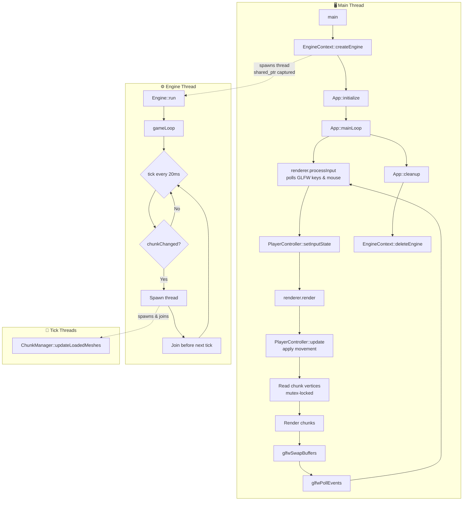
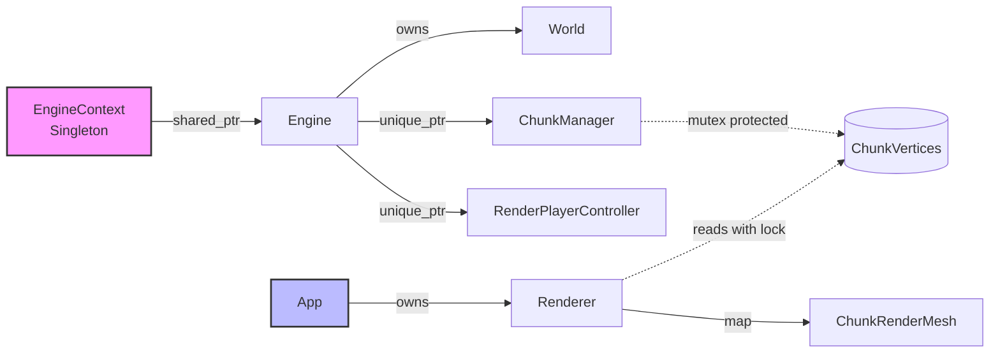
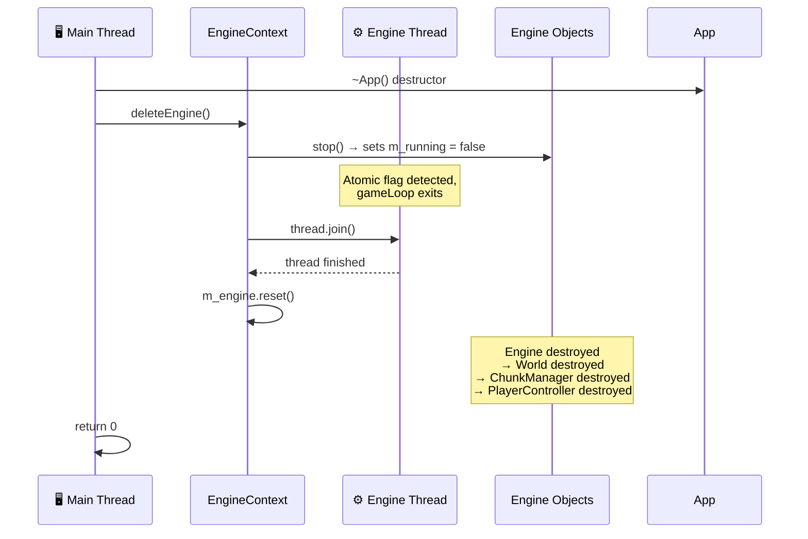

# Voxel World Documentation

## Multithreading 

Qt creates multiple Threads to handle its GUI
Here I create the EngineContext that creates the Engine and moves it to its own Thread
Inputs from the Qt Gui are then stored in the PlayerController in the engine-thread
Bevor each frame in the paint function the position of the player is updated from the rendering thread
When the player moves over the boarder of a chunk a signal is sent, 
which is received by the engine, which recalculates the chunks that should be rendered

This is noticed by the rendering thread which then will initiate the creation of the chunk and mesh generation.

## Program Execution & Threading

### Thread Overview

| Thread | Created By | Purpose |
|--------|-----------|---------|
| **Main Thread** | OS (`main()`) | GLFW window management, input polling, OpenGL rendering |
| **Engine Thread** | `EngineContext::createEngine()` | Game loop @50 ticks/sec, chunk management, player position updates |
| **Tick Threads** | `Engine::tick()` | Chunk mesh generation (spawned & joined per tick when player crosses chunk boundary) |

### Thread Interaction Flow

### Object Ownership

### Cleanup Sequence

When the program exits, objects are destroyed in this order:

### Synchronization Mechanisms

| Mechanism | Purpose |
|-----------|---------|
| `std::atomic<bool> m_running` | Signals engine thread to stop |
| `std::mutex` (ChunkVertices) | Protects chunk vertex data between engine and renderer threads |
| `std::shared_ptr<Engine>` | Ensures Engine stays alive while engine thread is running (ref count = 2) |

### Data Flow Summary

1. **Input**: Main thread polls GLFW input → updates `RenderPlayerController`
2. **Position Sync**: Before each frame, renderer reads player position from engine thread
3. **Chunk Detection**: Engine thread checks if player crossed chunk boundary
4. **Mesh Generation**: On boundary crossing, engine spawns tick thread to regenerate visible chunk meshes
5. **Rendering**: Main thread reads chunk vertices (mutex-protected) and renders

## Cube Faces

| n |face|
|---|----|
| 0 | +x |
| 1 | +y |
| 2 | +z |
| 3 | -x |
| 4 | -y |
| 5 | -z |

## Traversing Order (most inner loop first)

x -> z -> y

## Vertex Data Structure (uint64_t)

16 bit: block id

pos = coord / 8 => This allows for subvoxel detail meshes

8 bit: x \
8 bit: y \
8 bit: z

8 bit: width \
8 bit: height

5 bit: rotation

3 bit: free

### Rotation / Face

0-5 same as cube faces